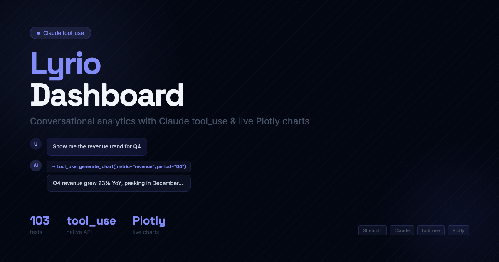

# Lyrio Dashboard

A multi-page Streamlit analytics platform combining Plotly dashboards with Claude AI to track real estate leads, bot performance, campaign costs, and ROI across a live GoHighLevel pipeline.

[](https://python.org)
[](https://github.com/ChunkyTortoise/lyrio-dashboard/actions)
[](LICENSE)

## Screenshots

| Concierge Chat | Cost & ROI |
|----------------|------------|
|  |  |

*Run `streamlit run app.py` to see the live UI with demo data (no API keys required).*

## Features

- **AI Concierge** — Claude tool_use chat answering questions about leads, costs, and follow-up strategy using 5 structured tools
- **Lead Browser** — searchable, filterable table of all tracked leads with temperature scoring (FRS), stage, and conversation transcripts
- **Cost & ROI Tracker** — month-by-month Plotly bar charts of AI token spend, commission ROI, and cost per qualified lead
- **Bot Command Center** — real-time status cards for Seller, Buyer, and Lead bots showing response times, success rates, and lead temperature distribution
- **Lead Activity Feed** — filterable event timeline (handoffs, temperature changes, messages) with bot badges and live auto-refresh
- **Demo / Live toggle** — deterministic demo data (seed 20260221) or live GoHighLevel API data via a sidebar switch

## Tech Stack

| Layer | Technology |
|-------|------------|
| UI | Streamlit 1.35+ |
| Charts | Plotly 5.18+ |
| AI | Anthropic Claude (tool_use) |
| Data | Pandas 2.1+ |
| CRM integration | GoHighLevel REST API (via `requests`) |
| Auto-refresh | streamlit-autorefresh |

## Architecture

```
lyrio-dashboard/
├── app.py                    Entry: config, CSS, sidebar, routing, mode detection
├── theme.py                  CSS injection (fonts, colors, component classes)
├── components.py             Pure HTML render functions (no business logic)
├── charts.py                 Plotly builders (style_chart, area_chart, bar_chart, sparkline)
├── backend/
│   ├── models.py             Frozen dataclasses (all data shapes)
│   ├── data_provider.py      Protocol + factory
│   ├── demo_data.py          DemoDataProvider — seeded random, deterministic
│   ├── live_data.py          LiveDataProvider — reads from GoHighLevel API
│   ├── ghl_client.py         GHLClient — contacts + conversations HTTP client
│   ├── concierge.py          Claude tool_use chat module
│   └── seed_constants.py     Curated lead names, addresses, messages
└── pages/
    ├── concierge_chat.py     Chat UI + ConciergeChat wiring
    ├── bot_command_center.py Bot cards + tabs
    ├── cost_roi_tracker.py   Month selector + metrics + charts
    ├── lead_activity_feed.py Filter bar + event feed
    └── lead_browser.py       Searchable lead table + detail panel
```

**Data flow:** `app.py` calls `_get_provider()` (cached via `@st.cache_resource`). If GHL credentials are present in `secrets.toml`, it returns a `JorgeApiDataProvider` or `LiveDataProvider`; otherwise it falls back to `DemoDataProvider` with a fixed seed for consistent demo data across sessions.

## Local Setup

```bash
git clone https://github.com/ChunkyTortoise/lyrio-dashboard
cd lyrio-dashboard
python -m venv venv && source venv/bin/activate
pip install -r requirements.txt
streamlit run app.py
```

To enable live data, create `.streamlit/secrets.toml`:

```toml
[anthropic]
api_key = "sk-ant-..."

[ghl]
api_key = "..."
location_id = "..."
```

Without secrets, the dashboard runs in Demo mode with realistic seeded data.

## Tests

```bash
pytest tests/ -v
```

103 tests passing.

## License

MIT
